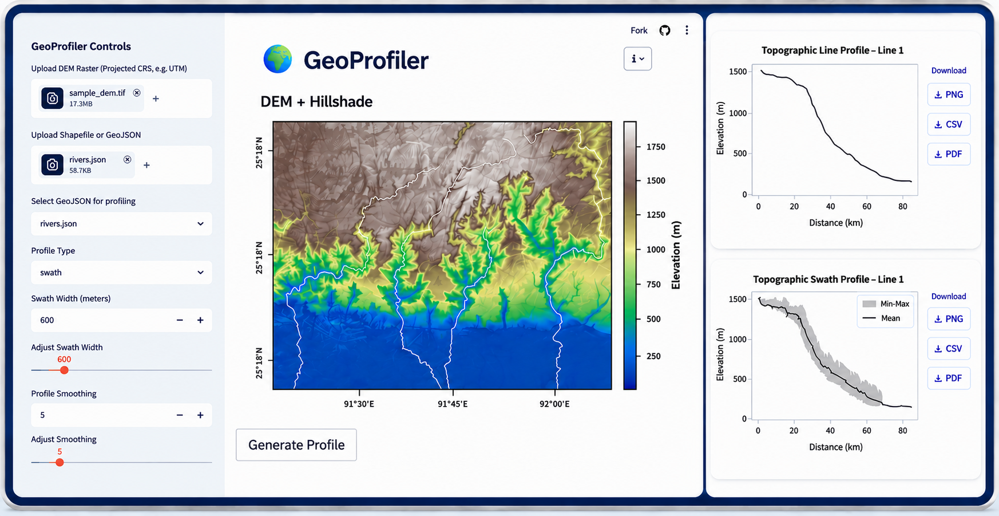

# GeoProfiler

[](https://geoprofiler.streamlit.app)


🌐 **[GeoProfiler Web App](https://geoprofiler.streamlit.app)**

*An open-source geospatial web application for extracting and visualizing topographic profiles from Digital Elevation Models (DEMs).*

GeoProfiler enables rapid extraction and visualization of topographic **line** and **swath** profiles through a user-friendly web interface. 

GeoProfiler streamlines the extraction and visualization of topographic profiles, reducing repetitive manual processing when working with multiple profile lines and large terrain datasets.

---

## Features

* DEM visualization with hillshade
* Line profile generation
* Swath profile generation
* Shapefile and GeoJSON support
* Automatic vector reprojection
* PNG, PDF, and CSV exports

---

## Sample Dataset

A ready-to-use sample dataset is provided in `/sample_data`.

Includes:
- sample_dem.tif (~17 MB DEM raster)
- rivers.json (GeoJSON river profiles)
- River shapefile components
- Cross-section shapefile components

### Quick Test

1. Upload `sample_dem.tif`
2. Upload `rivers.json` or the river shapefile
3. Generate line or swath profiles
4. Export results for further analysis

---

## DEM Requirements

* DEMs must use a **projected Coordinate Reference System (CRS)** (e.g., UTM or other projected CRS with metric units).
* Geographic coordinate systems such as **WGS84 (latitude/longitude)** are not recommended because profile distances and swath widths require linear units for accurate terrain analysis.
* Elevation values are recommended to be in **meters**.
* GeoProfiler assumes that the uploaded raster represents elevation data.
* Hydrologically corrected or filled DEMs are recommended for river and drainage profile analysis.

---

## Supported Vector Data

GeoProfiler accepts linear features representing the profile path.

### Supported Geometry Types

* LineString
* MultiLineString

### Supported Formats

* GeoJSON (`.geojson`)
* Shapefile (`.shp`, `.shx`, `.dbf`, `.prj`)

> **Note:** All Shapefile components must be uploaded together. The `.prj` file is required for CRS detection and automatic reprojection.

### Example Profile Features

* River and stream centerlines
* Topographic cross-sections
* Geological fault profiles
* Escarpment and ridge profiles

---

## Coordinate Reference Systems (CRS)

* If the vector dataset and DEM use different coordinate reference systems, GeoProfiler automatically reprojects the vector data to match the DEM CRS.
* DEM reprojection is not performed automatically.
* For best results, ensure that the DEM is already provided in an appropriate projected CRS.

---

## Profile Types

### Line Profile

* Extracts elevation values directly along a user-defined profile line.
* Suitable for river longitudinal profiles, terrain cross-sections, and fault profiling.

### Swath Profile

* Extracts minimum, mean, and maximum elevation statistics within a user-defined corridor around the profile line.
* Useful for valley analysis, terrain characterization, and geomorphological investigations.

---

## Outputs

Generated profiles can be exported as:

* **PNG** — high-quality image output
* **PDF** — publication-ready vector graphics
* **CSV** — profile data for further analysis in GIS, Excel, MATLAB, Python, or other software

---

## Applications

* River longitudinal profiling
* Terrain and geomorphological analysis
* Fault and escarpment investigations
* Watershed and drainage studies
* Infrastructure and route planning

---

## Installation

Clone the repository:

```bash
git clone https://github.com/chandnivermageo/GeoProfiler-WebApp.git
cd GeoProfiler-WebApp
```

Install dependencies:

```bash
pip install -r requirements.txt
```

Run the application:

```bash
streamlit run app.py
```

---

## Developed By

**Chandni Verma**

LinkedIn: https://www.linkedin.com/in/chandni-verma-geo/
